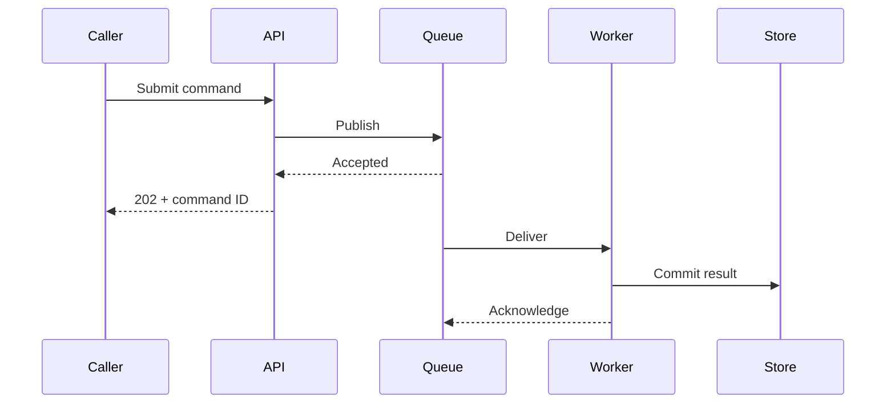
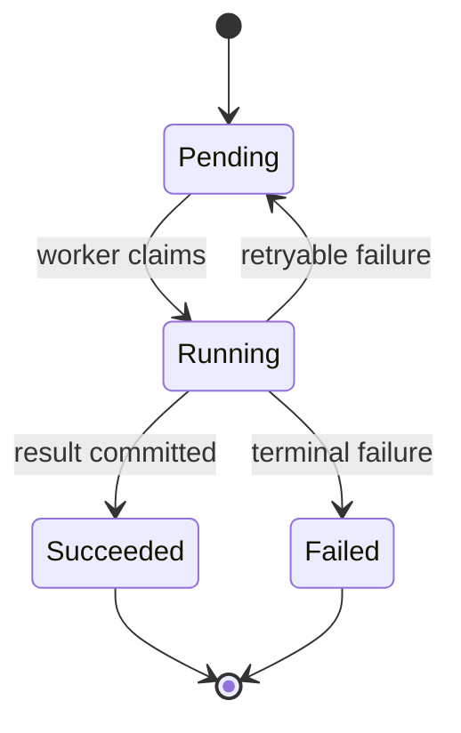
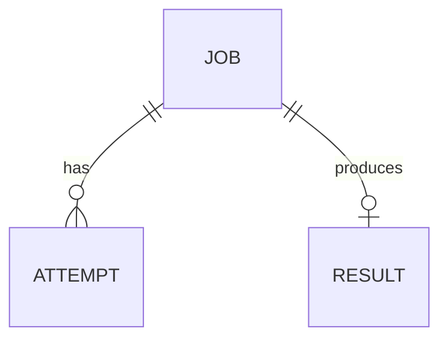

# Internal documentation patterns

Use this reference when structuring architecture, component, flow, operational, or decision documentation.

## en-US language and source integrity

- Write original prose in en-US, using American spelling and punctuation.
- Preserve source symbols, configuration keys, log text, protocol terms, product names, and quotations exactly.
- Keep established domain terminology even when a literal differs from house style; do not rename a contract while documenting it.
- Leave non-en-US locale trees and translation catalogs unchanged.

## Recommended narrative order

For most internal chapters, use this order:

1. Scope and conclusion.
2. Responsibilities and boundaries.
3. Principal flow or lifecycle.
4. Contracts and invariants.
5. Failure and recovery behavior.
6. Operational or change implications.
7. Source and test references.

This sequence lets readers form a model before they encounter edge cases.

## System overview pattern

A useful overview answers:

- What enters and leaves the system?
- Which components own which responsibilities?
- Where are state and durable data held?
- Which dependencies are external?
- Where are trust, process, network, or consistency boundaries?
- What are the one or two principal flows?
- Which constraints dominate the design?

Use a component table alongside a diagram:

| Component | Owns | Depends on | Does not own |
|---|---|---|---|
| API | Request validation and admission | Auth service, queue | Long-running execution |
| Worker | Command execution and result production | Queue, database | Public request authentication |

The "does not own" column prevents ambiguous responsibility.

## Component pattern

A component chapter should normally include:

1. **Purpose:** one responsibility statement.
2. **Boundary:** inputs, outputs, state, and collaborators.
3. **Contract:** behavior consumers may rely on.
4. **Invariants:** conditions maintained across operations.
5. **Flow:** the normal path.
6. **Failure behavior:** rejection, retry, partial completion, cleanup.
7. **Operations:** configuration and signals.
8. **Change guide:** extension points, hazards, and tests.

Contract table:

| Input or event | Preconditions | Result | Errors or rejection |
|---|---|---|---|
| `Submit(command)` | Valid identity; unique idempotency key | Command accepted for processing | Invalid input, duplicate conflict, unavailable queue |

Invariant table:

| Invariant | Enforced by | Evidence | Failure consequence |
|---|---|---|---|
| A command ID maps to at most one committed result | Database unique constraint and transaction | Constraint test | Duplicate externally visible result |

## Flow documentation

Describe flows from trigger to externally meaningful completion. Distinguish:

- Admission from execution.
- Delivery from processing.
- Processing from durable commit.
- Durable commit from notification.
- Retryable failure from terminal failure.

A sequence diagram should not carry these semantics alone; state them in prose or a contract table.

Sequence example:

````markdown

````

Then state: "The `202` response guarantees queue acceptance, not execution or durable result commit."

## Lifecycle documentation

Use a state diagram when valid transitions matter:

````markdown

````

Follow with a transition table for guards and side effects:

| From | Event | Guard | To | Side effect |
|---|---|---|---|---|
| `Running` | Retryable error | Attempts remain | `Pending` | Increment attempt; schedule delay |
| `Running` | Result committed | Commit succeeds | `Succeeded` | Emit completion event |

## Persistent data and schemas

Use `erDiagram` only when entity relationships help maintainers reason about ownership, cardinality, or migration:

````markdown

````

Do not reproduce the full database schema in a diagram. Document:

- Ownership and source of truth.
- Primary identifiers and idempotency keys.
- Cardinality and lifecycle coupling.
- Transaction boundaries.
- Retention and deletion behavior.
- Compatibility rules for readers and writers.
- Migration ordering and rollback constraints.

Schema field table:

| Field | Type | Required | Constraint | Evolution rule |
|---|---|---:|---|---|
| `version` | integer | Yes | Positive, monotonic | Readers must reject unsupported future versions |

## Failure-mode pattern

Write failure documentation around detection and action, not a list of exceptions.

| Failure | Detection signal | Propagation | Automatic response | Operator or developer action |
|---|---|---|---|---|
| Queue unavailable | Publish error; availability metric | Request rejected | Bounded retry | Restore queue; verify backlog |
| Commit conflict | Conflict error; transaction metric | Attempt retried | Re-read and retry | Inspect repeated conflicts for invariant violation |

Call out partial success and ambiguous outcomes. State whether retry is safe and what makes it idempotent.

## Configuration pattern

| Setting | Scope | Default | Runtime effect | Restart required | Risk |
|---|---|---|---|---:|---|
| `worker.max_in_flight` | Worker | `32` | Bounds concurrent jobs | No | High values can overload dependencies |

Separate configuration syntax from operational guidance. A setting table explains what exists; prose explains how to choose values.

## Decision matrix

Use a table for alternatives, then record the decision in prose.

| Option | Strength | Cost | Rejected because |
|---|---|---|---|
| Direct database polling | Simple dependencies | Polling load and latency | Does not meet latency target at expected scale |
| Queue | Explicit backpressure | Additional operational component | Selected |

Do not hide the decision in the table. State it clearly and list consequences.

## Diagram selection

| Question | Mermaid type | Include |
|---|---|---|
| What are the boundaries and dependencies? | `flowchart` | Components, stores, external systems, labeled edges |
| In what order do actors interact? | `sequenceDiagram` | Requests, events, acknowledgments, failure path |
| Which transitions are valid? | `stateDiagram-v2` | States, events, guards, terminal states |
| How is durable data related? | `erDiagram` | Entities, ownership-relevant cardinality |
| Which types form a stable model? | `classDiagram` | Only contract-level types and relationships |

### Diagram quality rules

- Use Mermaid only when the renderer is configured and available through the book configuration, build tooling, dependencies, and CI.
- Keep one abstraction level.
- Use the same component names as prose and code.
- Label asynchronous boundaries and acknowledgments.
- Show persistence only where durability matters.
- Show external systems and trust boundaries when relevant.
- Avoid decorative colors or custom Mermaid directives unless the book standardizes them.
- Avoid syntax newer than the installed Mermaid version.
- Add a textual conclusion and any invariants the diagram implies.

## Structural-density review

Use length and visual weight to locate possible design problems in the documentation. These signals trigger review; they do not require mechanical splitting.

| Signal to review | Engineering question | Typical correction |
|---|---|---|
| Paragraph longer than five sentences | Are contract, implementation, rationale, limitation, or failure behavior being conflated? | Separate the claims and label the kind of truth explicitly |
| List longer than seven to ten items | Is there a verified grouping by ownership, lifecycle, failure class, or risk? | Group by that taxonomy, use a focused table, or move exhaustive detail to reference material |
| Procedure longer than ten steps | Does it cross preparation, execution, verification, recovery, or rollback boundaries? | Divide it into phases and state the checkpoint or rollback condition for each |
| Section with its own contract, state model, failure behavior, or change guide | Does it support an independent maintenance decision? | Promote it to a component, lifecycle, flow, operational, or extension-point chapter |
| Table with several comparison dimensions or prose-heavy cells | Is the table combining contract, evidence, rationale, and exceptions? | Split it into focused tables and move qualifications to prose |
| Diagram with multiple abstraction levels or principal flows | Can one question be answered without the other view? | Create separate system, component, sequence, state, or data diagrams |
| Code sample exposing several contracts or extension mechanisms | Which single invariant or change pattern should it establish? | Include smaller anchored regions with an explanation for each |
| Heading followed by one ordinary sentence | Is it a stable anchor, decision status, or required navigation target? | Merge it when no such purpose exists |

A section that dominates the chapter often conceals a second maintenance problem. Check whether normal flow, failure flow, operational guidance, or change guidance should become a focused page. Conversely, do not fragment a cohesive contract or invariant into many tiny sections merely to satisfy a threshold.

## Source inclusion

The built-in `links` preprocessor runs by default unless `[build].use-default-preprocessors = false`. Confirm that it is active before including a focused anchored region:

````markdown
```rust
{{#include ../../src/worker.rs:retry_contract}}
```
````

Resolve the include path relative to the chapter that contains the directive. A useful anchor should expose a contract or extension pattern, not an arbitrary implementation block. Avoid:

- Whole files.
- Generated code.
- Line-number ranges likely to drift.
- Snippets that require extensive hidden context.
- Duplicating a schema that has a generated reference page.

## What not to document

Do not create:

- A prose inventory of every directory or function.
- Diagrams that mirror every call edge.
- Guarantees inferred only from current control flow.
- Operational advice without a signal or verification step.
- Historical detail that does not explain the present design.
- Large code dumps in place of a contract.
- Multiple inconsistent names for the same component or event.
