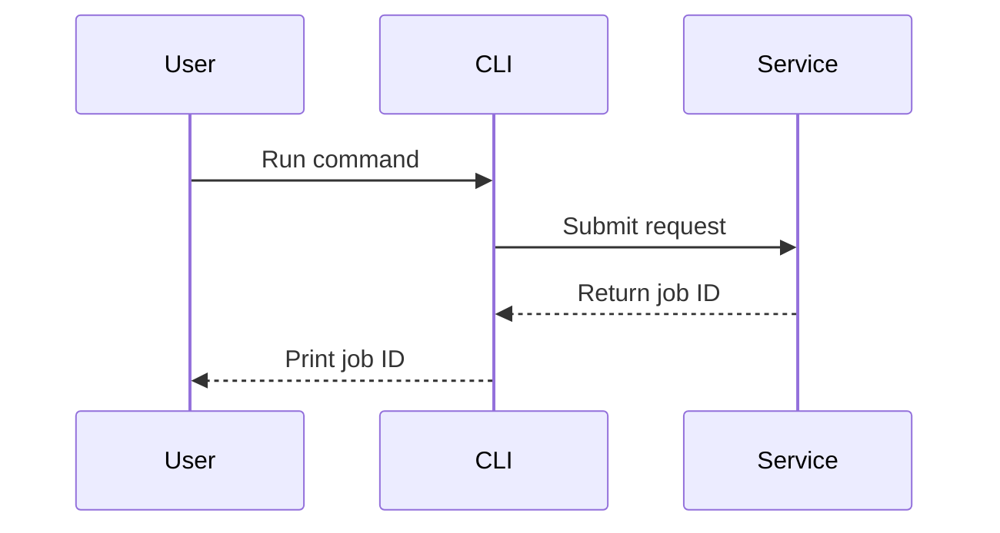

# User documentation writing toolkit

Use this reference when the correct structure or Markdown element is not obvious.

## en-US language and source integrity

- Write original prose in en-US, using American spelling and punctuation.
- Preserve commands, identifiers, configuration keys, UI strings, product names, protocol terms, and quotations exactly as they appear in authoritative sources.
- Reuse established public terminology even when a literal does not match house style; do not rename an interface to normalize its spelling.
- Leave non-en-US locale trees and translation catalogs unchanged.

## Select the right element

| Information shape | Prefer | Avoid |
|---|---|---|
| One claim or explanation | Short paragraph | A one-item list |
| Several independent facts | Bullets | A wide table with empty cells |
| Required sequence | Ordered list | Bullets that hide ordering |
| Repeated fields across items | Table | Repeating the same prose pattern |
| Exact syntax or input | Fenced code block | Inline code longer than one line |
| Branching decision | Small flowchart | A long nested list |
| Interaction over time | Sequence diagram | Paragraphs that repeatedly name actors |
| Lifecycle | State diagram | A vague list of status names |

## Page patterns

### How-to

1. State the outcome.
2. List only real prerequisites.
3. Give the shortest safe procedure.
4. Provide a success check.
5. Add focused troubleshooting.
6. Link to a related concept or reference page instead of expanding scope.

### Tutorial

A tutorial should produce a working result through a controlled path. Use checkpoints so a reader can detect drift early. Do not make the tutorial carry every option or edge case; link to reference material.

### Concept

Start with a one-paragraph mental model. Then explain boundaries, observable behavior, and implications. Examples should clarify the model, not become an unrelated procedure.

### Reference

Use stable headings and predictable field tables. Put normative statements close to the syntax or option they govern. Separate defaults, valid values, constraints, and version notes.

Example:

| Field | Required | Default | Meaning |
|---|---:|---|---|
| `endpoint` | Yes | - | Service URL used for requests |
| `timeout` | No | `30s` | Maximum time allowed per request |

### Troubleshooting

Start with the symptom the user can observe. Prefer a compact table when causes and actions are independent.

| Symptom | Likely cause | Action |
|---|---|---|
| Command exits with code 2 | Invalid argument | Run with `--help` and correct the named option |
| Request times out | Endpoint is unreachable or slow | Verify connectivity, then increase `timeout` only if the endpoint is healthy |

Do not list speculative causes without a way to distinguish them.

## The internal-detail relevance test

Use this sequence:

1. Describe the user-visible fact.
2. Ask whether the reader's action changes without the mechanism.
3. If no, stop.
4. If yes, explain the smallest mechanism that enables the action.
5. Link to internal documentation for implementation depth.

For this example, assume public documentation and tests establish that submission
returns before processing finishes and that a `status` command reports
completion. Those facts must be verified separately; the implementation sentence
alone does not establish them.

Instead of:

> The coordinator spawns a background Tokio task and sends work through an MPSC channel.

Write:

> The command returns before processing finishes. Run `status` to confirm completion.

The rewrite states the verified user impact without exposing incidental machinery.
Asynchronous execution alone does not establish completion ordering; a background
worker may process requests sequentially. Verify ordering independently, preserve
any guaranteed order, and omit commands or behaviors not supported by evidence.

## Tables

Use tables when readers will compare rows or scan by field. A good table has:

- A single comparison dimension per column.
- Short cells that can be understood without hidden context.
- Consistent units and value formats.
- Notes below the table for exceptions.

Convert a table back to prose when it has one row, mostly empty cells, or paragraphs inside cells.

## Diagrams

### Decision table

| Need | Diagram type | Typical user-facing use |
|---|---|---|
| Branching steps | `flowchart` | Setup choices, recovery paths |
| Requests and responses | `sequenceDiagram` | Authentication, webhook delivery |
| Status transitions | `stateDiagram-v2` | Job, deployment, or resource lifecycle |
| Data relationships | `erDiagram` | Only when users author or query the data model |

### Diagram rules

- Verify Mermaid or the relevant renderer is configured and available through `book.toml`, the build wrapper, dependency files, or CI.
- Match the syntax to the installed renderer version.
- Use a left-to-right direction for short processes and top-to-bottom for deeper branching.
- Keep labels reader-facing. Do not leak class or module names without a user need.
- Keep edge labels short and meaningful.
- Explain the key path in text.
- Split a diagram that needs a legend, tiny text, or more than one visual purpose.

Sequence example:

````markdown

````

Text after the diagram should state the consequence, for example: "The command confirms submission, not completion; use the job ID to check status."

## Portable callouts

Unless the book configures a dedicated admonition preprocessor, use ordinary Markdown blockquotes:

```markdown
> **Note:** This setting affects new jobs only.

> **Warning:** Rotating the key immediately invalidates existing sessions.
```

Reserve warnings for credible harm, data loss, security exposure, or difficult rollback. Do not turn routine information into callouts.

## Source-backed examples

The built-in `links` preprocessor runs by default unless `[build].use-default-preprocessors = false`. Confirm that it is active before including maintained examples instead of duplicating them:

````markdown
```rust
{{#include ../../examples/client.rs:basic}}
```
````

Resolve the include path relative to the chapter that contains the directive. Prefer named anchors to line-number ranges because anchors survive unrelated edits. Keep the included region focused enough to teach one point.

For non-Rust examples, still use a language tag, but validate them with the project's own tooling because `mdbook test` only tests Rust code samples.

## Link and navigation language

Use descriptive links:

- Good: `See [configure retries](retries.md#configure-retries).`
- Weak: `Click [here](retries.md).`

A `SUMMARY.md` label should tell readers what they will learn or do. Prefer "Configure authentication" over "Authentication details" when the chapter is procedural.

## Structural-density review

Length is a diagnostic signal, not a quality score. Keep a long block when it expresses one coherent idea clearly; restructure it when length reveals mixed purposes or weak navigation.

| Signal to review | Question to ask | Typical correction |
|---|---|---|
| Paragraph longer than five sentences | Does it contain more than one claim, action, condition, or decision? | Split at the change in purpose; use a list only when the items are genuinely parallel |
| List longer than seven to ten items | Can readers recognize meaningful categories or repeated fields? | Group under labels, use a compact table, or move exhaustive items to reference material |
| Procedure longer than ten steps | Does it cross setup, execution, verification, or recovery boundaries? | Divide it into named phases and add checkpoints without changing the required order |
| Section with its own prerequisites, workflow, model, or troubleshooting path | Can it be understood and linked independently? | Promote it to a focused chapter or page |
| Table wider than four columns or containing prose-heavy cells | Is it comparing one consistent dimension? | Split or transpose it, shorten cells, or return nuanced material to prose |
| Code block teaching several independent concepts | What single lesson should the reader retain? | Use separate examples with explicit purposes |
| Diagram answering more than one question | Are multiple abstraction levels or flows competing? | Create smaller diagrams, each with one stated conclusion |
| Heading followed by one ordinary sentence | Does the heading provide navigation, a stable anchor, or reference value? | Merge it into the surrounding section when it does not |

Also review a section that visually dominates its chapter. Size alone does not require a split, but dominance often indicates a hidden second task, an exhaustive option catalog, or edge cases that belong on a follow-up page.

Do not fragment cohesive definitions, warnings, or short reference entries solely to satisfy these thresholds. Avoid a sequence of tiny paragraphs or headings that makes readers reconstruct one idea across many blocks.

## Concision pass

After drafting:

1. Run the structural-density review and resolve only the signals that reveal mixed purposes or poor scanning.
2. Delete introductory sentences that repeat the heading.
3. Remove facts that do not change user understanding or action.
4. Replace repeated caveats with one scoped note.
5. Turn repeated field descriptions into a table.
6. Replace vague references such as "this" or "it" with the actual subject.
7. Shorten examples to the lines needed for the lesson.
8. Move advanced variants to a linked page.
9. Ensure every section earns its heading.
